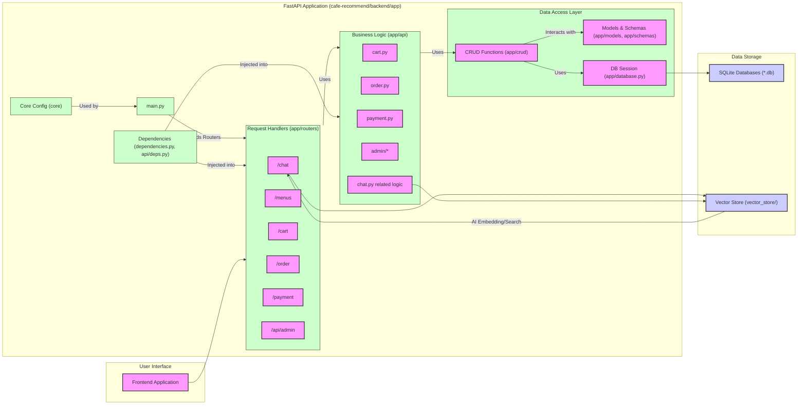
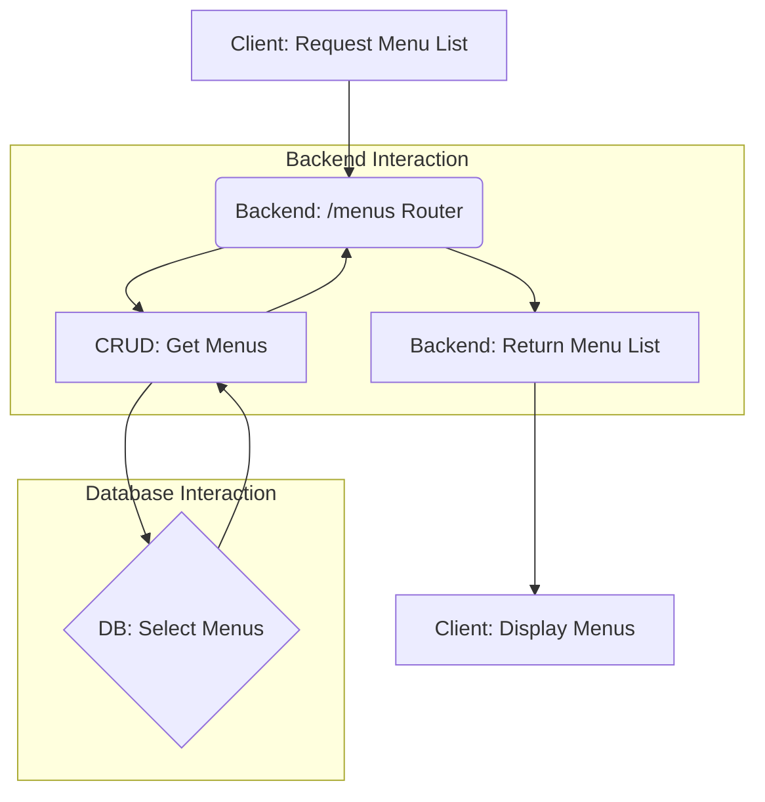
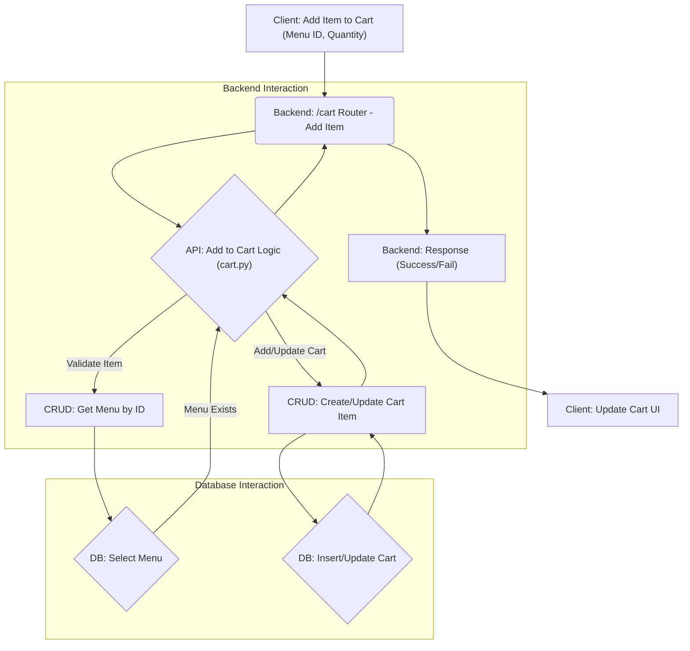
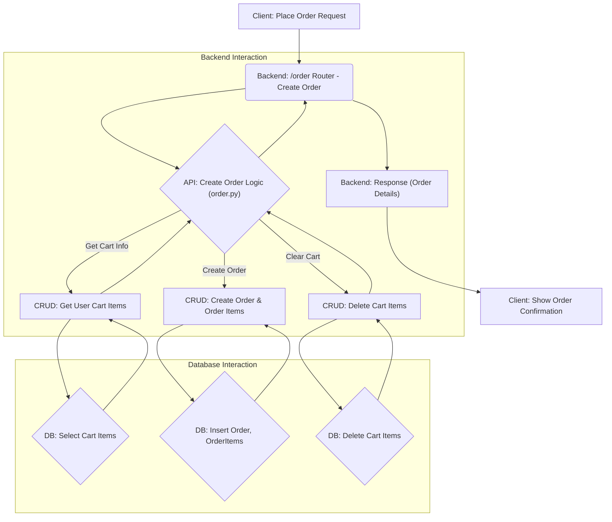
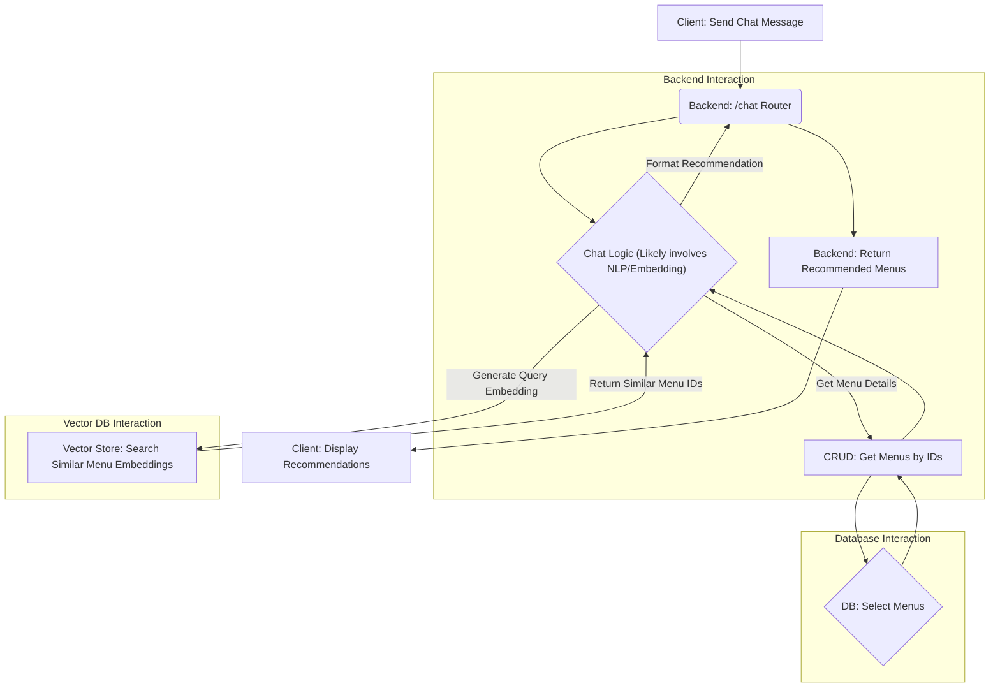

# Cafe Recommend Backend Architecture

## 1. 시스템 구성도 (Component Diagram)

**설명:**

*   **User Interface (Frontend):** 사용자와 상호작용하는 프론트엔드 애플리케이션입니다.
*   **Backend (FastAPI Application):** 핵심 비즈니스 로직을 처리하는 FastAPI 기반 백엔드입니다.
    *   `main.py`: 애플리케이션 진입점, 라우터 및 미들웨어 설정.
    *   **Routers:** HTTP 요청을 수신하고 적절한 API 로직으로 전달합니다. (메뉴, 장바구니, 주문, 결제, 채팅/추천, 관리자)
    *   **API Logic:** 각 기능(장바구니, 주문, 결제 등)에 대한 구체적인 비즈니스 로직을 포함합니다.
    *   **Dependencies:** 인증, 데이터베이스 세션 등 반복적으로 사용되는 의존성을 관리합니다.
    *   **Data Access Layer:** 데이터베이스와의 상호작용을 담당합니다.
        *   `CRUD Operations`: 데이터 생성, 읽기, 업데이트, 삭제 로직.
        *   `Models & Schemas`: 데이터베이스 테이블 구조(Models) 및 API 데이터 유효성 검사/직렬화(Schemas).
        *   `Database Interface`: 데이터베이스 연결 및 세션 관리.
    *   **Core Config:** 애플리케이션 설정 관리.
*   **Data Storage:** 데이터를 저장하는 공간입니다.
    *   **SQLite Databases:** 주요 애플리케이션 데이터(사용자, 메뉴, 주문 등) 저장.
    *   **Vector Store:** AI 기반 추천 기능을 위한 벡터 데이터 저장 (메뉴 임베딩 등).

## 2. 주요 데이터 흐름 예시 (Mermaid Flowchart)

### 2.1. 메뉴 조회

### 2.2. 장바구니에 메뉴 추가

### 2.3. 주문 생성

### 2.4. AI 메뉴 추천 (채팅)

## 3. 모듈별 주요 기능

*   **`app/main.py`**: FastAPI 앱 초기화, 라우터 포함, 미들웨어 설정.
*   **`app/database.py`**: SQLAlchemy 설정, 데이터베이스 세션 생성.
*   **`app/models/`**: SQLAlchemy 모델 정의 (데이터베이스 테이블 매핑).
*   **`app/schemas/`**: Pydantic 모델 정의 (API 데이터 유효성 검사 및 직렬화/역직렬화).
*   **`app/crud/`**: 데이터베이스 CRUD(Create, Read, Update, Delete) 로직 구현. 모델 객체와 상호작용.
*   **`app/routers/`**:
    *   `chat.py`: AI 기반 채팅 및 메뉴 추천 요청 처리. Vector Store 사용 가능성 높음.
    *   `menus.py`: 메뉴 목록 조회, 상세 정보 조회 등 메뉴 관련 요청 처리.
    *   `cart.py`: 장바구니 추가, 조회, 수정, 삭제 요청 처리.
    *   `order.py`: 주문 생성, 조회 등 주문 관련 요청 처리.
    *   `payment.py`: 결제 시작, 검증 등 결제 관련 요청 처리 (API 로직 호출).
*   **`app/api/`**:
    *   `cart.py`, `order.py`, `payment.py`: 각 라우터에서 호출되는 상세 비즈니스 로직 구현 (CRUD 함수 사용).
    *   `admin/`: 관리자 관련 API 로직.
    *   `deps.py`: API 레벨의 의존성 주입 (e.g., 현재 사용자 정보 가져오기).
*   **`app/core/`**: 설정 값 로딩 등 애플리케이션의 핵심 설정 관리.
*   **`vector_store/`**: AI 추천을 위한 메뉴 임베딩 등 벡터 데이터 저장.
*   **Root Directory Files**:
    *   `requirements.txt`: Python 패키지 의존성 목록.
    *   `.env*`: 환경 변수 설정 파일.
    *   `alembic/`, `alembic.ini`: Alembic 데이터베이스 마이그레이션 설정 및 스크립트.
    *   `init_*.py`, `update_*.py`: 초기 데이터 생성 및 업데이트 스크립트. 